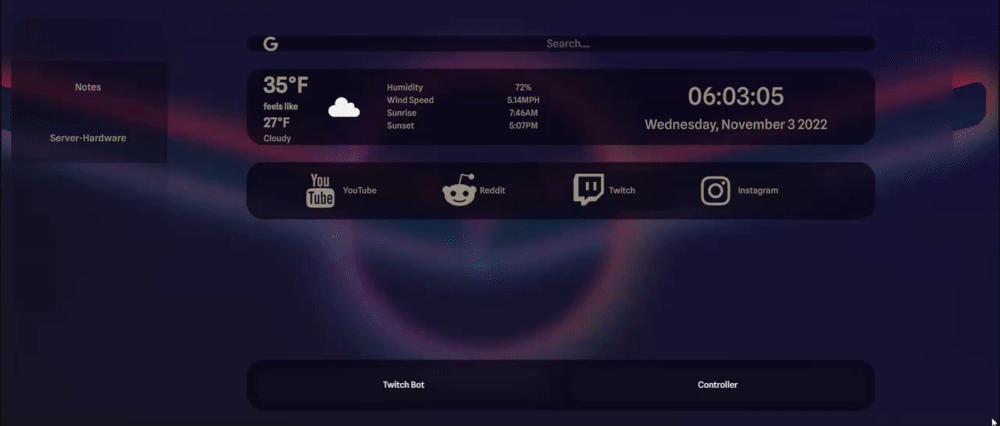

# Terrace Dashboard
## _A free Dashboarding tool for all your tools_


A tool comprised of a useful "Home Page" style dashboard running in a web browser, deployable remote Python clients that monitor hardware statistics and state of the host machine(s), as well as an available communication protocol for displaying the status of additional "services", that can be implemented into any project that utilizes Web Socket communication.

# Features
#### &nbsp;&nbsp;&nbsp;&nbsp;&nbsp;&nbsp;Dashboard
- Search bar for google
- Weather, sunset/sunrise, date and time
- Section for bookmarks
- Automatic display of hardware clients in the left navigation bar
- Automatic display of connected 
- Automatically updated charts displaying varius CPU, RAM and Storage statistics of connected Hardware Clients
#### &nbsp;&nbsp;&nbsp;&nbsp;&nbsp;&nbsp;Hardware Client
- Automatic communication of hardware status and statistics to the server that communicates:
  - CPU Core Count, CPU Usage, CPU Frequency
  - RAM total, Available, Percentage Used
  - Total Storage, Available Storage, Used Storage

## Tech

Terrace Dashboard uses a number of open source projects to work properly:

- [FastAPI](https://fastapi.tiangolo.com/) - Python backend
- [Python](https://www.python.org/) - Application framework for creating local web app-like applications, easy to package and run!
- Vanilla Javascript 
- HTML 
- CSS


## Installation

TDB requires [Python 3.7+](https://www.python.org/), and the installation of all libraries included in the pyproject.toml to run
1. Install dependencies via pip (In repo directory)
    ```sh
    pip install requirements.txt
    ```
2. Sign up for [OpenWeatherMap Free API](https://openweathermap.org/api)
3. Add your latitude, Longitude and API Key in static/weatherAPI.js
    - Run the server and connect to http://localhost/stats
    - Run the hardware client(s) on host machine and/or remote machines while the server is running


## Development

Want to contribute? Great!
##### Developers
- https://github.com/sockheadrps
- https://github.com/beaux44


## License

[MIT](https://www.mit.edu/~amini/LICENSE.md)

**Free Software, Hell Yeah!**

[//]: # (These are reference links used in the body of this note and get stripped out when the markdown processor does its job. There is no need to format nicely because it shouldn't be seen. Thanks SO - http://stackoverflow.com/questions/4823468/store-comments-in-markdown-syntax)


