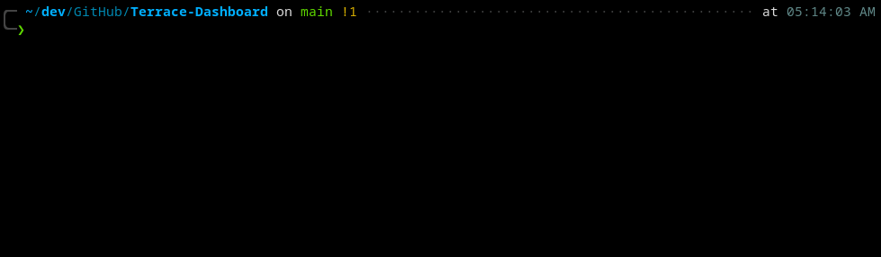
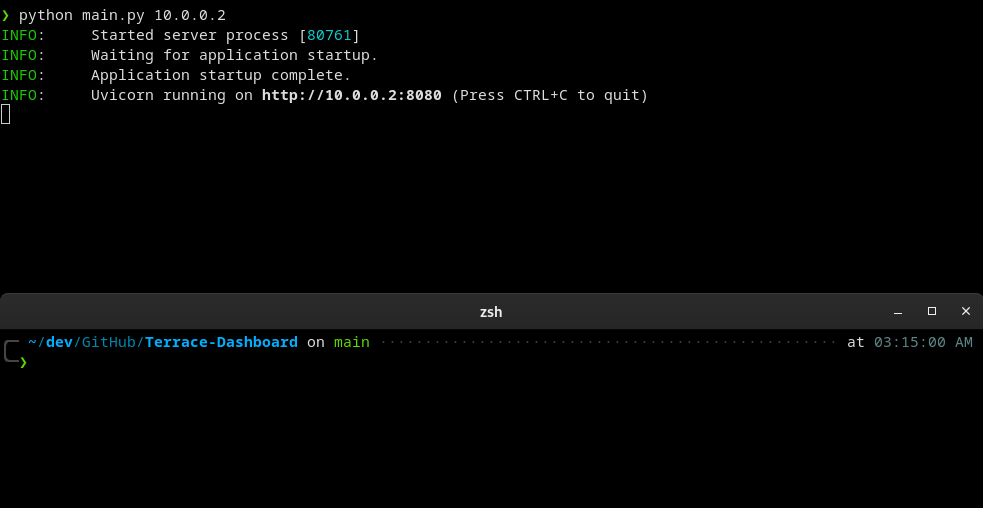

# Terrace Dashboard
## _A free Dashboarding tool for all your tools_


A tool comprised of a useful "Home Page" style dashboard running in a web browser, deployable remote Python clients that monitor hardware statistics and state of the host machine(s), as well as an available communication protocol for displaying the status of additional "services", that can be implemented into any project that utilizes Web Socket communication.

# Features
### <u>Dashboard</u>
- Search bar for Google / Youtube
- Weather, sunset/sunrise, date and time
- Section for bookmarks
- Automatic display of hardware clients in the left navigation bar
- Automatic display of connected services
- Automatically updated charts displaying various CPU, RAM and Storage statistics of connected Hardware Clients
- Notes (Save, edit, delete) with markdown capabilities (and syntax highlighting!)

### <u>Hardware Client</u>
- Automatic connection of hardware status and statistics to the server that communicates:
  - CPU Core Count, CPU Usage, CPU Frequency
  - RAM total, Available, Percentage Used
  - Total Storage, Available Storage, Used Storage

## Tech
Terrace Dashboard uses the following technologies:
- [Python](https://www.python.org/)
- [FastAPI](https://fastapi.tiangolo.com/)
- [Svelte](https://svelte.dev/)
- [Chart.js](https://github.com/chartjs/Chart.js)
- [Svelte-exmarkdown](https://github.com/ssssota/svelte-exmarkdown)
- [Codemirror](https://codemirror.net/)
- [Svelte-Highlight](https://github.com/metonym/svelte-highlight)


## Installation

TDB has been tested on [Python 3.7+](https://www.python.org/), and requires the installation of all libraries in requirements.txt
```
pip install -r requirements.txt
```
TDB also requires you to build the Svelte frontend before you can use it. This requires [Node.js 12+](https://nodejs.org/en/) 
```
cd Terrace-Svelte
npm install
npm run build
```
1. Navigate to the server folder, and run the server.
```
python main.py
```

2. Connect to the dashboard via  xxx.xxx.xxx.xxx/dashboard in your browser.
4. Sign up for [OpenWeatherMap Free API](https://openweathermap.org/api)
   1. Enter your longitude / latitude and API key in weather settings and save


### Optional:
- Run the hardware client(s) on host machine and/or remote machines while the server is running
- Implement and connect any "Services." An example service in the clients folder is provided to assist you in structuring you projects to communicate with the server.
```
python hardware_client.py xxx.xxx.xxx.xxx Hardware-client-name
```



## Development
Want to contribute? Great!
##### Developers
- https://github.com/sockheadrps
- https://github.com/beaux44
- https://github.com/embedvr


## License

[Gitstar](https://github.com/sockheadrps/gitstar/blob/main/gitstar_license)


[//]: # (These are reference links used in the body of this note and get stripped out when the markdown processor does its job. There is no need to format nicely because it shouldn't be seen. Thanks SO - http://stackoverflow.com/questions/4823468/store-comments-in-markdown-syntax)
