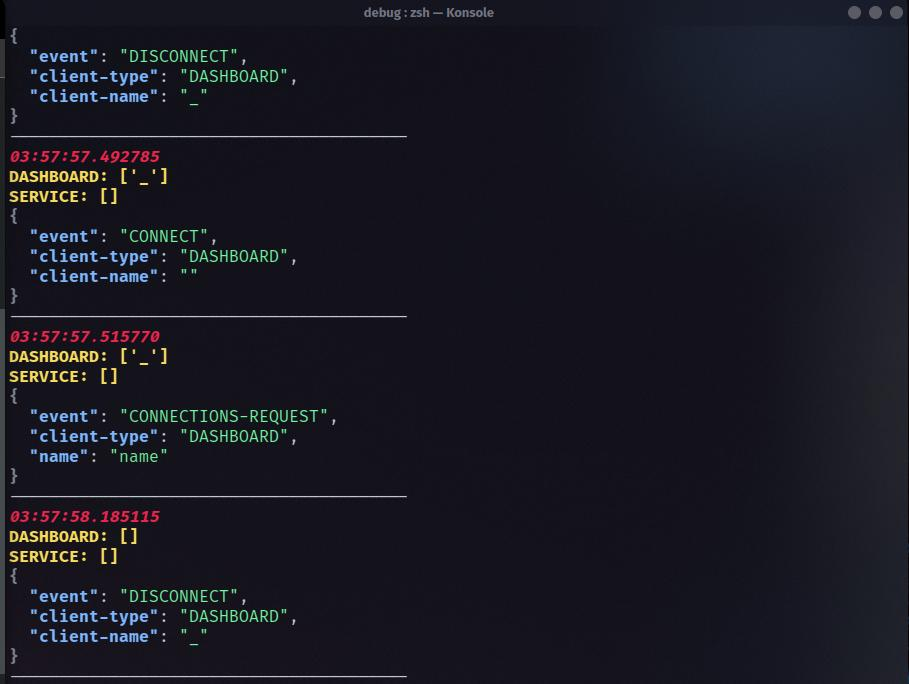

Simple echo client to help debug the server. It just echos any communication the server gets.

Each print includes a list of each client type and list of the names of the connected clients of that type, and the JSON data that the server recieved.

to run add the ip adress of the server:
```
python debugger.py SERVERIP
```

